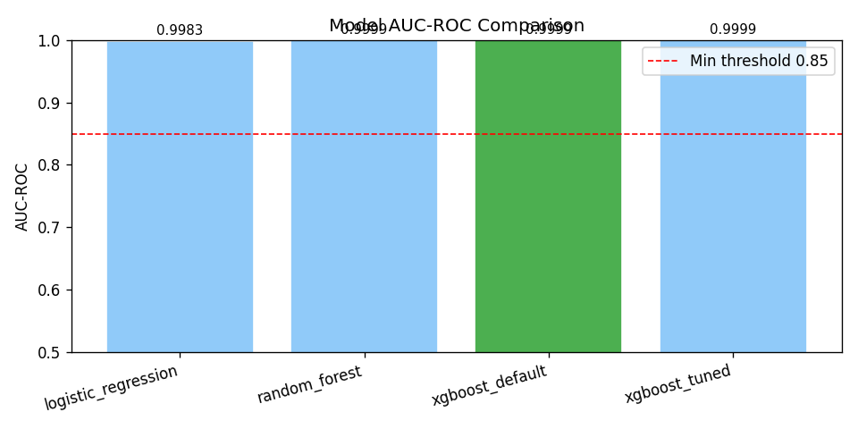
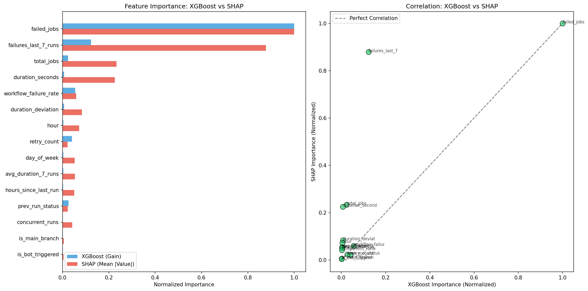

# 🚀 Pipeline Autopilot

**MLOps CI/CD Pipeline Failure Prediction System**

[](https://www.python.org/downloads/)
[](https://airflow.apache.org/)
[](https://www.docker.com/)
[](https://mlflow.org/)
[](https://xgboost.readthedocs.io/)
[](https://fairlearn.org/)

---

## 📋 Table of Contents

1. [Project Overview](#-project-overview)
2. [How to Replicate](#-how-to-replicate-step-by-step-setup)
3. [How to Run the Data Pipeline](#-how-to-run-the-data-pipeline)
4. [How to Run the Model Pipeline](#-how-to-run-the-model-pipeline)
5. [How to Run Tests](#-how-to-run-tests)
6. [Project Structure](#-project-structure)
7. [Pipeline Architecture](#-pipeline-architecture)
8. [Dataset Information](#-dataset-information)
9. [Model Development](#-model-development)
10. [Experiment Tracking with MLflow](#-experiment-tracking-with-mlflow)
11. [Model Validation](#-model-validation)
12. [Model Bias Detection (Fairlearn)](#-model-bias-detection-fairlearn)
13. [Sensitivity Analysis (SHAP)](#-sensitivity-analysis-shap)
14. [CI/CD Pipeline Automation](#-cicd-pipeline-automation)
15. [Model Registry & Deployment](#-model-registry--deployment)
16. [Data Versioning with DVC](#-data-versioning-with-dvc)
17. [Team Members](#-team-members)

---

## 📖 Project Overview

**Pipeline Autopilot** is an MLOps system that predicts CI/CD pipeline failures before they happen using Machine Learning, and explains root causes using RAG (Retrieval-Augmented Generation).

### Problem Statement
- Data pipelines fail unexpectedly → engineers waste hours debugging
- Manual monitoring is inefficient and reactive
- No proactive failure prevention exists

### Our Solution
- **Predict** pipeline failures before execution using ML models
- **Warn** users with probability scores
- **Explain** root causes using RAG
- **Suggest** fixes based on historical patterns

### Key Features
- ✅ Automated data acquisition and preprocessing
- ✅ Schema validation and statistics generation
- ✅ Anomaly detection with alerts
- ✅ Data-level and model-level bias detection
- ✅ Data versioning with DVC
- ✅ Full pipeline orchestration with Apache Airflow
- ✅ ML model training with XGBoost + hyperparameter tuning
- ✅ Experiment tracking with MLflow
- ✅ Model validation with threshold analysis and rollback
- ✅ Model-level bias detection with Fairlearn
- ✅ Sensitivity analysis with SHAP
- ✅ CI/CD automation with GitHub Actions
- ✅ Model registry push to GCP Artifact Registry
- ✅ Comprehensive logging, error handling, and unit tests

---

## 🔧 How to Replicate (Step-by-Step Setup)

Follow these instructions to set up the project on your machine.

### Prerequisites

| Software | Version | Download Link |
|----------|---------|---------------|
| Python | 3.10+ | [python.org](https://www.python.org/downloads/) |
| Docker Desktop | Latest | [docker.com](https://www.docker.com/products/docker-desktop/) |
| Git | Latest | [git-scm.com](https://git-scm.com/downloads) |

### Step 1: Clone the Repository

```bash
git clone https://github.com/anita2210/pipeline-autopilot.git
cd pipeline-autopilot
```

### Step 2: Create Environment File

Create a `.env` file in the project root:

```bash
# For Windows PowerShell:
echo "AIRFLOW_UID=50000" > .env

# For Mac/Linux:
echo "AIRFLOW_UID=$(id -u)" > .env
```

### Step 3: Install Python Dependencies (Optional - for local development)

```bash
# Create virtual environment
python -m venv venv

# Activate virtual environment
# Windows:
venv\Scripts\activate
# Mac/Linux:
source venv/bin/activate

# Install dependencies
pip install -r requirements.txt
```

### Step 4: Verify Setup

```bash
# Test configuration
python scripts/config.py
```

Expected output:
```
============================================================
PIPELINE AUTOPILOT CONFIGURATION
============================================================
✅ All directories verified/created!
✅ Raw dataset found: .../data/raw/final_dataset.csv
```

---

## ▶️ How to Run the Data Pipeline

### Step 1: Start Docker Desktop

Make sure Docker Desktop is running (check for "Engine running" status).

### Step 2: Start Airflow

```bash
cd pipeline-autopilot

# Start all services
docker-compose up -d
```

Wait 2-3 minutes for all containers to initialize.

### Step 3: Verify Containers are Running

```bash
docker-compose ps
```

Expected output:
```
NAME                           STATUS
pipeline_autopilot_postgres    Up (healthy)
pipeline_autopilot_scheduler   Up (healthy)
pipeline_autopilot_triggerer   Up (healthy)
pipeline_autopilot_webserver   Up (healthy)
```

### Step 4: Access Airflow Web UI

1. Open browser: **http://localhost:8080**
2. Login credentials:
   - **Username:** `admin`
   - **Password:** `admin`

### Step 5: Run the Data DAG

1. Find DAG: `pipeline_autopilot_data_pipeline`
2. Enable the DAG (toggle switch ON)
3. Click **Play ▶️** button → **Trigger DAG**
4. Click on DAG name → **Graph** tab to watch execution

### Step 6: Monitor Pipeline Execution

All 7 tasks should complete successfully (green):

```
data_acquisition      ✅
data_preprocessing    ✅
schema_validation     ✅ (parallel)
bias_detection        ✅ (parallel)
anomaly_detection     ✅
dvc_versioning        ✅
pipeline_complete     ✅
```

### Step 7: Stop Airflow (when done)

```bash
docker-compose down
```

---

## 🤖 How to Run the Model Pipeline

### Option 1: Run via Airflow (Model DAG)

1. Start Airflow (same steps as above)
2. Find DAG: `pipeline_autopilot_model_pipeline`
3. Enable and trigger the DAG
4. Monitor the model pipeline tasks:

```
load_processed_data          ✅
train_models                 ✅
select_best_model            ✅
validate_model               ✅
model_bias_detection         ✅ (parallel)
sensitivity_analysis         ✅ (parallel)
validation_gate              ✅
push_to_registry             ✅
model_pipeline_complete      ✅
```

### Option 2: Run Scripts Individually

```bash
# Step 1: Train models (Logistic Regression, Random Forest, XGBoost)
python scripts/model_training.py

# Step 2: Track experiments with MLflow
python scripts/experiment_tracking.py

# Step 3: Validate the best model on hold-out set
python scripts/model_validation.py

# Step 4: Run model-level bias detection with Fairlearn
python scripts/model_bias_detection.py

# Step 5: Run SHAP sensitivity analysis
python scripts/model_sensitivity.py

# Step 6: Push validated model to registry
python scripts/model_registry.py
```

### Option 3: Run via Docker

```bash
# Build the model training container
docker build -f Dockerfile.model -t pipeline-autopilot-model .

# Run model training
docker run pipeline-autopilot-model
```

### View MLflow Experiment Results

```bash
# Start MLflow UI
mlflow ui --port 5000

# Open browser: http://localhost:5000
```

---

## 🧪 How to Run Tests

### Run All Tests

```bash
cd pipeline-autopilot

# Activate virtual environment
source venv/bin/activate  # Mac/Linux
venv\Scripts\activate     # Windows

# Run all tests
pytest tests/ -v
```

### Run Data Pipeline Tests

```bash
pytest tests/test_data_preprocessing.py -v
pytest tests/test_schema_validation.py -v
pytest tests/test_anomaly_detection.py -v
pytest tests/test_logging_config.py -v
```

### Run Model Pipeline Tests

```bash
pytest tests/test_model_training.py -v
pytest tests/test_model_validation.py -v
pytest tests/test_model_bias.py -v
```

### Run Tests with Coverage Report

```bash
pytest tests/ -v --cov=scripts --cov-report=html
```

### Expected Test Output

```
tests/test_data_preprocessing.py::test_load_data PASSED
tests/test_data_preprocessing.py::test_handle_missing_values PASSED
tests/test_schema_validation.py::test_validate_schema PASSED
tests/test_anomaly_detection.py::test_detect_anomalies PASSED
tests/test_model_training.py::test_train_model PASSED
tests/test_model_validation.py::test_validate_model PASSED
tests/test_model_bias.py::test_bias_detection PASSED
...
================= X passed in Y.YYs =================
```

---

## 📁 Project Structure

```
pipeline-autopilot/
│
├── dags/
│   ├── pipeline_dag.py              # Data pipeline Airflow DAG (7 tasks)
│   └── model_dag.py                 # Model pipeline Airflow DAG (9 tasks)
│
├── scripts/
│   ├── config.py                    # Central configuration
│   ├── data_acquisition.py          # Data loading & validation
│   ├── data_preprocessing.py        # Data cleaning & transformation
│   ├── schema_validation.py         # Schema & statistics generation
│   ├── anomaly_detection.py         # Outlier detection & alerts
│   ├── bias_detection.py            # Data-level bias analysis
│   ├── dvc_versioning.py            # Data version control
│   ├── logging_config.py            # Logging configuration
│   ├── model_training.py            # Model training & selection (NEW)
│   ├── experiment_tracking.py       # MLflow experiment tracking (NEW)
│   ├── model_validation.py          # Hold-out validation & threshold analysis (NEW)
│   ├── model_bias_detection.py      # Model-level bias with Fairlearn (NEW)
│   ├── model_sensitivity.py         # SHAP feature importance (NEW)
│   └── model_registry.py            # GCP Artifact Registry push (NEW)
│
├── models/                          # Model artifacts (NEW)
│   ├── trained/                     # Saved model files (.joblib)
│   │   ├── best_model.joblib
│   │   ├── previous_model.joblib
│   │   └── previous_metrics.json
│   ├── registry/                    # Registry metadata & bias reports
│   │   ├── registry_manifest.json
│   │   └── model_bias_report.json
│   └── sensitivity/                 # SHAP & feature importance outputs
│       ├── hyperparameter_sensitivity/
│       ├── auc_comparison.png
│       └── feature_importance_comparison.png
│
├── data/
│   ├── raw/                         # Raw dataset
│   ├── processed/                   # Cleaned dataset
│   ├── schema/                      # Schema & statistics JSON files
│   └── reports/                     # Bias detection reports (PNG)
│
├── tests/
│   ├── conftest.py                  # Test fixtures
│   ├── test_data_preprocessing.py   # Preprocessing tests
│   ├── test_schema_validation.py    # Schema validation tests
│   ├── test_anomaly_detection.py    # Anomaly detection tests
│   ├── test_logging_config.py       # Logging tests
│   ├── test_model_training.py       # Model training tests (NEW)
│   ├── test_model_validation.py     # Model validation tests (NEW)
│   └── test_model_bias.py           # Model bias tests (NEW)
│
├── .github/
│   └── workflows/
│       └── ml_pipeline.yml          # CI/CD with GitHub Actions (NEW)
│
├── logs/                            # Airflow logs
├── mlruns/                          # MLflow experiment logs (gitignored)
│
├── .dvc/                            # DVC configuration
├── dvc.yaml                         # DVC pipeline definition
├── dvc.lock                         # DVC lock file
│
├── docker-compose.yaml              # Airflow Docker setup
├── Dockerfile.model                 # Docker for model training (NEW)
├── requirements.txt                 # Python dependencies
├── .gitignore                       # Git ignore rules
├── .env                             # Environment variables
└── README.md                        # This file
```

---

## 🔄 Pipeline Architecture

### Data Pipeline DAG

```
┌──────────────────┐
│ data_acquisition │
└────────┬─────────┘
         │
         ▼
┌────────────────────┐
│ data_preprocessing │
└────────┬───────────┘
         │
    ┌────┴────┐
    │         │
    ▼         ▼
┌─────────┐ ┌─────────────┐
│ schema  │ │    bias     │  ← PARALLEL EXECUTION
│validation│ │  detection  │
└────┬────┘ └──────┬──────┘
     │             │
     └──────┬──────┘
            │
            ▼
   ┌─────────────────┐
   │anomaly_detection│
   └────────┬────────┘
            │
            ▼
   ┌─────────────────┐
   │  dvc_versioning │
   └────────┬────────┘
            │
            ▼
   ┌─────────────────┐
   │pipeline_complete│
   └─────────────────┘
```

### Model Pipeline DAG

```
┌──────────────────────┐
│  load_processed_data │
└──────────┬───────────┘
           │
           ▼
┌──────────────────────────────────────────────────┐
│  train_models (Logistic Reg, RF, XGBoost + tuning)│
└──────────┬───────────────────────────────────────┘
           │
           ▼
┌──────────────────────────────────┐
│  select_best_model (AUC-ROC)    │
└──────────┬───────────────────────┘
           │
           ▼
┌──────────────────────────────────────────┐
│  validate_model (hold-out, threshold)    │
└──────────┬───────────────────────────────┘
           │
      ┌────┴────┐
      │         │
      ▼         ▼
┌───────────┐ ┌─────────────┐
│model_bias │ │ sensitivity │  ← PARALLEL EXECUTION
│detection  │ │  analysis   │
└─────┬─────┘ └──────┬──────┘
      │              │
      └──────┬───────┘
             │
             ▼
   ┌───────────────────────────────────────────┐
   │  validation_gate (AUC > 0.85? No bias?)   │
   └──────────┬────────────────────────────────┘
              │
              ▼
   ┌──────────────────────────────────┐
   │  push_to_registry (GCP Artifact) │
   └──────────┬───────────────────────┘
              │
              ▼
   ┌───────────────────────┐
   │ model_pipeline_complete│
   └───────────────────────┘
```

### Data Pipeline Execution Screenshots

#### Pipeline Status & Task History
All 7 tasks completed successfully with multiple successful runs:


#### Graph View - DAG Structure
Shows parallel execution of `schema_validation` and `bias_detection`:


#### Gantt Chart - Execution Timeline
Visualizes task duration and parallel execution:


### Model Pipeline Execution Screenshots

#### Model DAG - Graph View
<!-- 📸 SCREENSHOT NEEDED: Airflow Graph view of model_dag showing all tasks green -->


#### Model DAG - Task History
<!-- 📸 SCREENSHOT NEEDED: Airflow task history showing successful model pipeline runs -->


---

## 📊 Dataset Information

### Overview

The project uses a **preprocessed dataset** generated by `data_preprocessing.py` from the raw CI/CD pipeline logs.

| Property | Value |
|----------|-------|
| **File** | `data/processed/final_dataset_processed.csv` |
| **Total Rows** | 149,967 |
| **Total Columns** | 32 |
| **Target Variable** | `failed` (binary: 0/1) |
| **Failure Rate** | ~11.33% |

### Data Pipeline Flow

```
Raw Data                          Preprocessed Data
(final_dataset.csv)        →     (final_dataset_processed.csv)
150,000 rows x 26 cols           149,967 rows x 32 cols
                           ↑
                  data_preprocessing.py
                  - Handle missing values
                  - Remove duplicates (33 removed)
                  - Encode categoricals (+6 new cols)
                  - Validate constraints
                  - Cap outliers
```

### Column Descriptions

| Category | Columns |
|----------|---------|
| **ID** | run_id |
| **Datetime** | trigger_time |
| **Temporal** | day_of_week, hour, is_weekend |
| **Performance** | duration_seconds, avg_duration_7_runs, duration_deviation |
| **Historical** | prev_run_status, failures_last_7_runs, workflow_failure_rate, hours_since_last_run |
| **Complexity** | total_jobs, failed_jobs, retry_count, concurrent_runs |
| **Risk** | head_branch, is_main_branch, is_first_run, is_bot_triggered, trigger_type |
| **Categorical** | pipeline_name, repo, failure_type, error_message |
| **Target** | failed |

### Preprocessing Applied

| Step | Description |
|------|-------------|
| Missing Values | Median for numerical, mode for categorical |
| Duplicates | Removed based on `run_id` |
| Datetime Parsing | `trigger_time` converted to datetime |
| Categorical Encoding | Frequency encoding for high-cardinality, label encoding for low-cardinality |
| Outlier Capping | IQR method (1.5x multiplier) |
| Constraint Validation | `failed_jobs <= total_jobs`, `workflow_failure_rate` between 0-1 |

---

## 🧠 Model Development

### Approach

We train and compare multiple ML models to predict CI/CD pipeline failures (`failed` = 1) using the preprocessed dataset (149,967 rows, 32 features).

### Data Split

| Set | Split | Purpose |
|-----|-------|---------|
| Train | 70% | Model training |
| Validation | 15% | Hyperparameter tuning |
| Test | 15% | Final hold-out evaluation |

Stratified on `failed` to preserve the ~11.33% failure rate across all splits.

### Models Trained

| Model | Description | Class Imbalance Handling |
|-------|-------------|--------------------------|
| Logistic Regression | Linear baseline | `class_weight='balanced'` |
| Random Forest | Ensemble baseline | `class_weight='balanced'` |
| **XGBoost** | Gradient boosting (primary) | `scale_pos_weight` (~7.8x) |

### Hyperparameter Tuning

XGBoost hyperparameters were tuned using RandomizedSearchCV / Optuna:

| Parameter | Search Space |
|-----------|-------------|
| `n_estimators` | 100 - 500 |
| `max_depth` | 3 - 10 |
| `learning_rate` | 0.01 - 0.3 |
| `subsample` | 0.6 - 1.0 |
| `colsample_bytree` | 0.6 - 1.0 |

### Model Selection

The best model is selected based on **AUC-ROC** on the validation set. The selected model is saved as `models/trained/best_model.joblib`.

**Script:** `scripts/model_training.py`

---

## 📈 Experiment Tracking with MLflow

All training runs are tracked using **MLflow** with experiment name `pipelineguard-model-dev`.

### What is Logged

| Category | Details |
|----------|---------|
| **Parameters** | All hyperparameters per model |
| **Metrics** | AUC-ROC, F1, Precision, Recall, Accuracy |
| **Artifacts** | Confusion matrices, comparison bar plots |
| **Model Versions** | Best model registered in MLflow Model Registry (Staging → Production) |

### MLflow UI

```bash
mlflow ui --port 5000
# Open: http://localhost:5000
```

#### MLflow Experiment Dashboard
<!-- 📸 SCREENSHOT NEEDED: MLflow UI showing experiment runs with metrics -->


#### Model Comparison - AUC Across Models
<!-- 📸 SCREENSHOT NEEDED: Bar plot comparing AUC of Logistic Reg, RF, XGBoost -->


**Script:** `scripts/experiment_tracking.py`

---

## ✅ Model Validation

### Hold-Out Evaluation

The best model is evaluated on the 15% test set that was never used during training or tuning.

### Metrics Computed

| Metric | Description |
|--------|-------------|
| Accuracy | Overall correct predictions |
| Precision | Of predicted failures, how many were real |
| Recall | Of real failures, how many were caught |
| F1-Score | Harmonic mean of precision and recall |
| AUC-ROC | Area under the ROC curve |
| AUC-PR | Area under the Precision-Recall curve |

### Threshold Analysis

Decision thresholds are varied from 0.1 to 0.9 to find the optimal threshold for F1-score. This generates a threshold-vs-metric plot.

<!-- 📸 SCREENSHOT NEEDED: Threshold vs F1/Precision/Recall plot -->


### Confusion Matrix

<!-- 📸 SCREENSHOT NEEDED: Confusion matrix heatmap for best model on test set -->


### Validation Gate

The model must pass the following checks before proceeding to registry:
- AUC-ROC > 0.85
- No critical bias flags
- Performance >= previous model (rollback otherwise)

### Rollback Mechanism

If the newly trained model performs worse than the previous best model (compared by AUC), the system rejects the new model and keeps `previous_model.joblib` as the production model.

**Script:** `scripts/model_validation.py`

---

## ⚖️ Model Bias Detection (Fairlearn)

### Data-Level Bias (Assignment 1)

We use **data slicing** to analyze failure rate distributions across subgroups.

| Feature | Type | Slices |
|---------|------|--------|
| `repo` | Categorical | 50 repositories |
| `pipeline_name` | Categorical | Multiple pipelines |
| `trigger_type` | Categorical | push, pull_request, schedule, etc. |
| `is_weekend` | Binary | Weekend vs Weekday |
| `is_bot_triggered` | Binary | Bot vs Human |

### Model-Level Bias (Assignment 2)

We use **Fairlearn MetricFrame** to evaluate whether the trained model predicts fairly across different subgroups.

### Slicing Features for Model Bias

| Feature | Why |
|---------|-----|
| `trigger_type` | Model shouldn't favor push over schedule |
| `is_bot_triggered` | Bot vs human runs should be treated fairly |
| `is_main_branch` | Main branch shouldn't be over/under-flagged |
| `is_weekend` | Weekend runs should get fair predictions |
| `repo` (top 10) | No single repo should be unfairly flagged |

### Metrics Tracked Per Slice

- Accuracy, F1, FPR (False Positive Rate), FNR (False Negative Rate)

### Disparity Metrics

- Demographic Parity Difference
- Equalized Odds Difference

### Bias Mitigation

If disparity exceeds 1.5x between any two groups:
- **ThresholdOptimizer** (Fairlearn) adjusts decision thresholds per group
- Or class re-weighting is applied

### Bias Report

Generated at: `models/registry/model_bias_report.json`

<!-- 📸 SCREENSHOT NEEDED: Per-slice metric bar charts (e.g., F1 by trigger_type) -->


**Script:** `scripts/model_bias_detection.py`

---

## 🔍 Sensitivity Analysis (SHAP)

### Feature Importance

We use **SHAP (SHapley Additive exPlanations)** to explain which features drive the model's predictions.

#### SHAP Summary Plot (Beeswarm)
<!-- 📸 SCREENSHOT NEEDED: SHAP beeswarm summary plot -->


#### Feature Importance Comparison
Compares SHAP-based importance vs XGBoost built-in `feature_importances_`:



### Hyperparameter Sensitivity

We vary the top 3 hyperparameters independently and plot AUC vs parameter value to show which hyperparameters have the most impact.

<!-- 📸 SCREENSHOT NEEDED: Hyperparameter sensitivity plots -->


**Script:** `scripts/model_sensitivity.py`

---

## 🔁 CI/CD Pipeline Automation

### GitHub Actions Workflow

The CI/CD pipeline is defined in `.github/workflows/ml_pipeline.yml` and triggers automatically on push to the `model-dev` branch.

### Pipeline Steps

```
Push to model-dev branch
        │
        ▼
  Install dependencies
        │
        ▼
  Run model training
        │
        ▼
  Run model validation
        │
        ▼
  Run bias detection
        │
        ▼
  Validation gate check
   (AUC > 0.85? No bias?)
        │
   ┌────┴────┐
   │         │
  PASS      FAIL
   │         │
   ▼         ▼
Push to    Block deploy
registry   + notify
```

### Automated Checks
- Model training completes successfully
- Validation metrics exceed thresholds
- Bias checks pass across all slices
- If any check fails → pipeline fails, team is notified

### GitHub Actions Run
<!-- 📸 SCREENSHOT NEEDED: GitHub Actions showing successful workflow run -->


**Config:** `.github/workflows/ml_pipeline.yml`

---

## 📦 Model Registry & Deployment

### Model Registry

Once the model passes validation and bias checks, it is pushed to **GCP Artifact Registry** (or GCS bucket as fallback).

### Registry Metadata

Each model version is tagged with:
- Model version ID (timestamp-based)
- AUC-ROC, F1, Precision, Recall
- Bias check status (pass/fail)
- Git commit hash

Registry manifest: `models/registry/registry_manifest.json`

**Script:** `scripts/model_registry.py`

---

## 📦 Data Versioning with DVC

### Initialize DVC (already done)

```bash
dvc init
```

### Track Data Files

```bash
dvc add data/raw/final_dataset.csv
dvc add data/processed/final_dataset_processed.csv
```

### Push to Remote Storage

```bash
# Configure remote (Google Cloud Storage)
dvc remote add -d gcs_remote gs://your-bucket-name

# Push data
dvc push
```

### Pull Data on Another Machine

```bash
dvc pull
```

### View Data Version History

```bash
dvc diff
```

---

## 👥 Team Members

| Member | Role | Assignment 1 | Assignment 2 |
|--------|------|-------------|-------------|
| Member 1 | Pipeline Architect / ML Engineer | Folder structure, config.py, Airflow DAG, Docker setup | Model training & selection, Model DAG |
| Member 2 | Data Engineer / MLOps Engineer | Data acquisition scripts | MLflow experiment tracking, model versioning |
| Member 3 | Data Scientist | Data preprocessing, feature engineering | Model validation, threshold analysis |
| Member 4 | Quality Engineer / Fairness Analyst | Schema validation, anomaly detection | Model-level bias detection (Fairlearn) |
| Member 5 | MLOps Engineer | DVC versioning, bias detection | SHAP sensitivity analysis, GCP registry push |
| Member 6 | Test Engineer / DevOps | Unit tests, logging configuration | CI/CD pipeline (GitHub Actions), Dockerfile, model tests |

---


## Troubleshooting

### Common Issues

**1. Docker containers not starting**
```bash
docker-compose down
docker-compose up -d
```

**2. Airflow UI not accessible**
- Wait 2-3 minutes after starting containers
- Check: `docker-compose ps` (all should show "healthy")

**3. DAG not visible in Airflow**
- Check for syntax errors: `python dags/pipeline_dag.py`
- Restart scheduler: `docker-compose restart airflow-scheduler`

**4. Tests failing**
- Ensure virtual environment is activated
- Install dependencies: `pip install -r requirements.txt`

**5. MLflow UI not loading**
- Make sure you ran at least one training experiment
- Check: `ls mlruns/` should have experiment folders
- Try: `mlflow ui --host 0.0.0.0 --port 5000`

**6. Model pipeline failing at validation gate**
- Check AUC threshold in config (default: 0.85)
- Review bias report: `models/registry/model_bias_report.json`
- If rollback triggered, check `models/trained/previous_metrics.json`

---

## 📄 License

This project is for educational purposes (MLOps Course Project - March 2026).

---

## 🔗 Links

- **GitHub Repository:** https://github.com/anita2210/pipeline-autopilot
- **Airflow UI:** http://localhost:8080 (when running)
- **MLflow UI:** http://localhost:5000 (when running)

---
